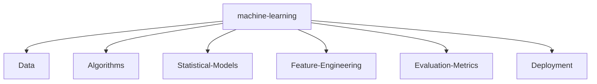

#  Hello!

<p align="center">
You have stayed on my page for:
</p>

<p align="center">
<a href="https://github.com/tomchen/animated-svg-clock" title="Animated SVG clock"></a>
</p>

<p>
    <a href="https://github.com/shiny0110/shiny0110"></a>
    <a href="https://github.com/shiny0110/shiny0110/graphs/contributors"></a>
    <a href="https://github.com/shiny0110/shiny0110/stargazers"></a>
    <a href="https://github.com/shiny0110/shiny0110/network/members"></a>
       
</p>

I am 🧙 Full-Stack Software Engineer and 🏆 Open Source lover

Welcome to my page; on my Github, you can find:

- Projects created by me
- Projects contributed by me

_I am open to new opportunities/contributions._

* <span title="I use">🧰</span>: <a href="https://www.typescriptlang.org/" title="Typescript"></a>
<a href="https://developer.mozilla.org/en-US/docs/Web/JavaScript" title="JavaScript"></a>
<a href="https://tc39.es/ecma262/" title="ECMAScript 6"></a>
<a href="https://reactjs.org/" title="React"></a>
<a href="https://redux.js.org/" title="Redux"></a>
<a href="https://vuejs.org/" title="Vue.js"></a>
<a href="https://angular.io/" title="Angular"></a>
<a href="https://svelte.dev/" title="Svelte"></a>
<a href="https://rxjs.dev/" title="RxJS"></a>
<a href="https://github.com/redux-observable/redux-observable" title="redux-observable"></a>
<a href="https://d3js.org/" title="D3"></a>
<a href="https://greensock.com/gsap/" title="GSAP"></a>
<a href="https://www.webrtc.org/" title="WebRTC"></a>
<a href="https://developers.google.com/web/tools/workbox" title="Workbox"></a>
<a href="https://jquery.com/" title="jQuery"></a>
<a href="https://www.w3.org/TR/CSS/" title="CSS3"></a>
<a href="https://sass-lang.com/" title="Sass"></a>
<a href="https://tailwindcss.com/" title="Tailwind CSS"></a>
<a href="https://material-ui.com/" title="Material UI"></a>
<a href="https://ant.design/" title="Ant Design"></a>
<a href="https://getbootstrap.com/" title="Bootstrap"></a>
<a href="https://www.w3.org/TR/html5/" title="HTML5"></a>
<a href="https://nodejs.org/" title="Node.js"></a>
<a href="https://expressjs.com/" title="Express"></a>
<a href="https://zeit.co/next" title="Next.js"></a>
<a href="https://electron.atom.io/" title="Electron"></a>
<a href="https://php.net/" title="PHP"></a>
<a href="https://laravel.com/" title="Laravel"></a>
<a href="https://www.java.com/" title="Java"></a>
<a href="https://spring.io/" title="Spring"></a>
<a href="https://www.python.org/" title="Python"></a>
<a href="https://pandas.pydata.org/" title="pandas"></a>
<a href="https://numpy.org/" title="NumPY"></a>
<a href="https://www.mongodb.org/" title="MongoDB"></a>
<a href="https://dev.mysql.com/" title="MySQL"></a>
<a href="https://www.postgresql.org/" title="PostgreSQL"></a>
<a href="https://graphql.org/" title="GraphQL"></a>
<a href="https://www.apollographql.com/" title="Apollo"></a>
<a href="https://git-scm.com/" title="Git"></a>
<a href="https://subversion.apache.org/" title="Subversion"></a>
<a href="https://www.npmjs.com/" title="npm"></a>
<a href="https://yarnpkg.com/" title="Yarn"></a>
<a href="https://webpack.js.org/" title="webpack"></a>
<a href="https://gulpjs.com/" title="gulp"></a>
<a href="https://rollupjs.org/" title="rollup.js"></a>
<a href="https://vitejs.dev/" title="Vite"></a>
<a href="https://www.snowpack.dev/" title="Snowpack"></a>
<a href="https://babeljs.io/" title="Babel"></a>
<a href="https://handlebarsjs.com/" title="Handlebars"></a>
<a href="https://eslint.org/" title="ESLint"></a>
<a href="https://prettier.io/" title="Prettier"></a>
<a href="https://jestjs.io/" title="Jest"></a>
<a href="https://github.com/enzymejs/enzyme" title="Enzyme"></a>
<a href="https://www.cypress.io/" title="Cypress"></a>
<a href="https://nightwatchjs.org/" title="Nightwatch.js"></a>
<a href="https://circleci.com/" title="CircleCI"></a>
<a href="https://codecov.io/" title="Codecov"></a>
<a href="https://code.visualstudio.com/" title="Visual Studio Code"></a>
<a href="https://www.sublimetext.com/" title="Sublime Text"></a>
<a href="https://www.gatsbyjs.com/" title="Gatsby"></a>
<a href="https://gohugo.io/" title="Hugo"></a>
<a href="https://wordpress.org/" title="WordPress"></a>
<a href="https://www.apache.org/" title="Apache"></a>
<a href="https://aws.amazon.com/" title="AWS"></a>
<a href="https://azure.microsoft.com/" title="Microsoft Azure"></a>
<a href="https://www.firebase.com/" title="Firebase"></a>
<a href="https://www.elastic.co/products/elasticsearch" title="Elasticsearch"></a>
<a href="https://www.cloudflare.com/" title="Cloudflare"></a>
<a href="https://openid.net/" title="OpenID"></a>
<a href="https://deno.land/" title="Deno"></a>
<a href="https://www.docker.com/" title="docker"></a>
<a href="https://reactnative.dev/" title="React Native"></a>
<a href="https://www.embarcadero.com/products/delphi" title="Delphi"></a>
<a href="https://en.wikipedia.org/wiki/C_(programming_language)" title="C"></a>
<a href="https://isocpp.org/" title="C++"></a>
<a href="https://www.r-project.org/" title="R"></a>
<a href="https://nsis.sourceforge.io/" title="NSIS"></a>
<a href="https://www.adobe.com/products/photoshop.html" title="Adobe Photoshop"></a>
<a href="https://www.adobe.com/products/illustrator.html" title="Adobe Illustrator"></a>
<a href="https://inkscape.org/" title="Inkscape"></a> ([geticon](https://github.com/get-icon/geticon "Get Icon Project"))
* <span title="I like">❤️</span>: <span title="programming">💻</span> <span title="photography">📷</span> <span title="traveling">🚗</span> <span title="jogging">🏃</span> <span title="melody writing">🎵</span> <span title="good UX and UI">🌻</span>

<p align="center">
(move your mouse over the text/icons to view explanation)
</p>

## Github stats:

<p align="center">
<a href="https://github.com/shiny0110">
  
  
</a>

</p>

---

## Personal stats:

#### With over 9 years of experience and 5+ years of education in Computer Science, a Lead Full-Stack Software Engineer specializes in designing and developing web applications. Skilled in JavaScript frameworks like React, Vue, Svelte, Stencil, and Angular, and proficient with back-end technologies such as Node, Go, and Rust, this role focuses on creating scalable, efficient, and secure applications.

<details>
  <summary>Highlights / Proficiencies / Interests / Believes</summary>

Highlights:

- ⭐ 9+ years of professional experience in full lifecycle development (web2/web3)
- ⭐ Delivered over 25+ projects
- ⭐ Worked with over 7+ companies from startup to enterprise level
- ⭐ Delivered over 50+ projects
- ⭐ Web2 and Web3 expert, I specialize in facilitating the seamless transition from Web2 to Web3 technologies.
- ⭐ Worked on innovative and cutting-edge projects
- ⭐ Contribute to industry thought leadership
- ⭐ Contribute to open source and private source
- ⭐ Master new technologies, master computer science and mathematics

Proficiencies:

- 📚 JavaScript, TypeScript, Node.js with Serverless and Containers and Microservices architecture
- 📚 React.js + Next.js + SSR/CSR + Prisma + Vercel
- 📚 Vue.js + Nuxt.js + SSR/CSR + TypeOrm + Cloudflare
- 📚 Angular, RxJS, NgRx
- 📚 Svelte and Stencil + Storybook + Web Components
- 📚 SQL and NoSQL databases (MySQL, PostgreSQL, MongoDB, DynamoDB, Redis)
- 📚 AWS, Azure and GCP
- 📚 Go lang, Move lang, Rust
- 📚 HTML5/CSS3 + Canvas + WebGL + Animation
- 📚 Agile, Scrum, Kanban
- 📚 Web2/Web3 startups
- 📚 Cryptography (cryptocurrency and blockchain)
- 📚 Team Leadership
- 📚 Project Leadership

Interests:

- ✔️ Self-education and self-development: Continuously seek opportunities for personal growth, self-improvement, and acquiring new knowledge and skills to stay at the forefront of industry trends and advancements.
- ✔️ Family: Place great importance on nurturing and cherishing family bonds, fostering strong relationships, and maintaining a healthy work-life balance to support personal well-being and fulfillment.
- ✔️ Sport (gym, padel tennis, crossfit): Engage in physical activities such as gym workouts, padel tennis, and crossfit, recognizing the importance of maintaining an active and healthy lifestyle to enhance productivity, focus, and overall well-being.

Big believer in:

- 💡 Power of continuous learning and personal growth
- 💡 Importance of cultivating a positive mindset and embracing optimism
- 💡 Value of hard work and perseverance in achieving success
- 💡 Power of empathy and kindness in fostering meaningful connections and creating a harmonious society
- 💡 Importance of ethical behavior and integrity in all aspects of life

</details>

## 🥇 Primary technology stack


## 🥈 Secondary technology stack


## 🥉 Tertiary technology stack


---

## Thanks for visiting

<p align="center"> 


Counting of visitors to this page in this section started from May 1, 2022

<a href="http://s01.flagcounter.com/more/ap7"></a>

---


<div align="center">
<summary>Trophy: Github Profile Trophy</summary>
</div>

<p align="center"> 
<a href="https://github.com/ryo-ma/github-profile-trophy"></a>
</p>

   <!--machine-learning-->




### Profile Views

counting of visitors to this page in this section started from June 12, 2022


</br>

[MIT](LICENSE)

---

## _If you liked my profile, you can Star ⭐ the repo and if you want to use this template you can Fork it and can use._

Would you like to meet me?

If you want to contribute to any of my repositories, feel free to submit PRs, issues and email me. Pick a slot if you'd like to meet me and chat about proposals and ideas - but make sure to describe the agenda

---


```TypeScript
// Check if the code is functioning correctly

// Let's ensure the code is the epitome of excellence
if (isCodeWorking) {
    console.log("✨ Code works! Time to polish it until it shines.");
    // Perfection is our destination, so onward we go!
    while (codeQuality < perfection) {
        codeQuality++; // Increment the code quality score
        console.log(`Improving... Code quality now at ${codeQuality}.`);
    }
    console.log("🏆 Code has reached perfection!");
}

// The cycle of life: eat, sleep, repeat
while (alive) {
    eat();
    sleep();
    console.log("Repeat! Because life is a loop. 🍕💤🔁");
}

// - Shiny
```
